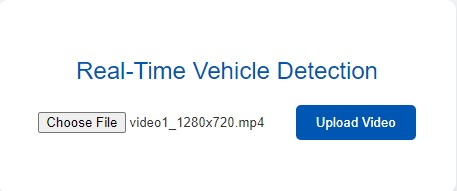
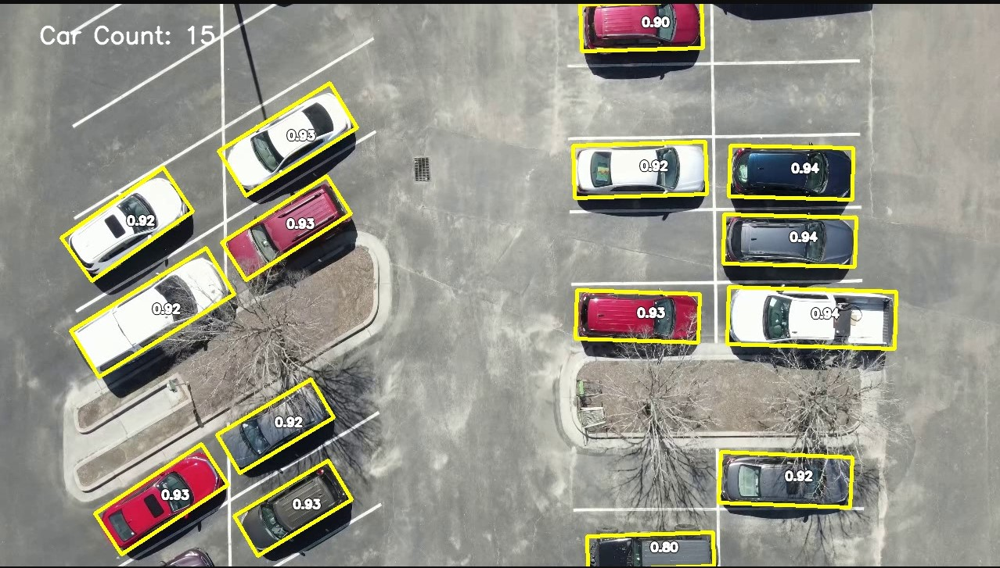

# Real Time Car Counter Live Demo

## About
The car counter demo will identify and count cars from an overhead perspective using a YOLOv8 Model.  For information about YOLO, please [visit the YOLOv8 docs](https://docs.ultralytics.com/).

## Demo Requirements
* An operating system such as Windows, Mac, or Linux that has access to a terminal (NOTE: the commands shown here are for Windows, but should be applicable to Mac and Linux as well)
* If running on Windows, you will need [the latest Microsoft Visual C++ Redistributable Version](https://learn.microsoft.com/en-US/cpp/windows/latest-supported-vc-redist)
* [git](https://git-scm.com/)
    * To ensure that you have git installed, open a terminal or command prompt and type 
    ```
    git --version
    ```
    Your output should look something like this
    <pre>
    C:\some\dir>git --version
    git version 2.42.0.windows.2
    </pre> 
* A browser such as Chrome, Firefox, Safari, etc.
* A current release of [python](https://www.python.org/downloads/) with [pip](https://pip.pypa.io/en/stable/installation/) installed. (NOTE: [anaconda](https://www.anaconda.com/download) will work as well, but you may have to translate some of the following steps using the [conda docs](https://docs.anaconda.com/).  If you're unsure, just use python)
    * To check that you've got python installed, open a terminal and type in 
    ```
    python --version
    ```  
    You're output should look something like this:
    <pre>
    C:\some\dir> python --version
    Python 3.11.8
    </pre>
    Note that the directory given here is only for example purposes.
    * Next, check that pip is installed by typing 
    ```
    python -m pip --version
    ```
    <pre>
    C:\some\dir>python -m pip --version
    pip 24.0 from C:\install\dir\Python311\site-packages\pip (python 3.11)
    </pre>

## Getting Started
* Clone the project 
```
git clone https://github.com/PowersOfEight/Real-Time-Inventory-Capstone-Project.git
```
* Navigate into the `install-dependencies` directory and run `install-deps.py`
```
cd Real-Time-Inventory-Capstone-Project/install-dependencies
```
```
python -m install-deps
```
## Demonstration session
* Navigate into the root of the project and run main.py
```
python -m main
```
<pre>
 * Serving Flask app 'main'
 * Debug mode: on
<span style="color: red">WARNING: This is a development server. Do not use it in a production deployment. Use a production WSGI server instead.</span>
 * Running on http://127.0.0.1:5000
<span style="color: gold">Press CTRL+C to quit</span>
 * Restarting with stat
 * Debugger is active!
 * Debugger PIN: 110-296-855
</pre>
* Now open a browser and type the following into the navigation bar:
```
http://localhost:5000
```
* You'll be greeted with the UI




* For convenience, there is a demo video with the appropriate 1280x720 resolution in the `demo-video` folder.  If you open it, you'll be greeted to a demonstration of the car counter:



* The car count is in the upper-left hand corner of the screen
* The numbers that appear above each car are the confidence scores of the prediction

## That's all for now, more coming soon!